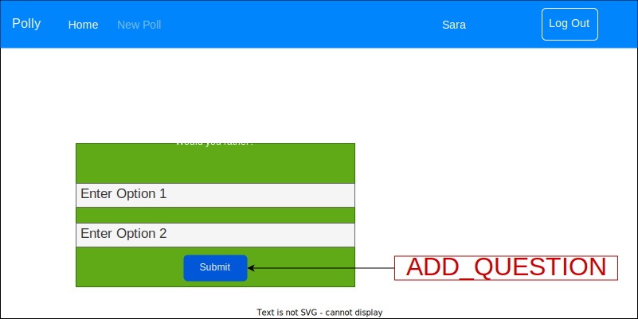
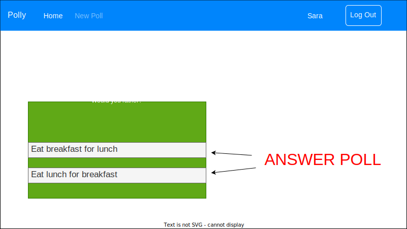
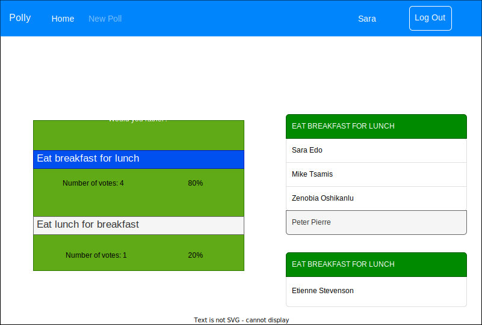
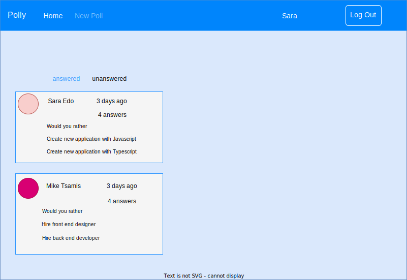
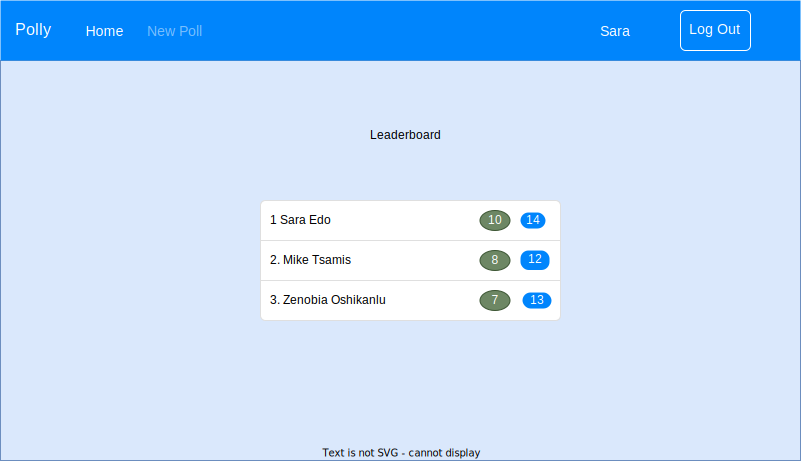
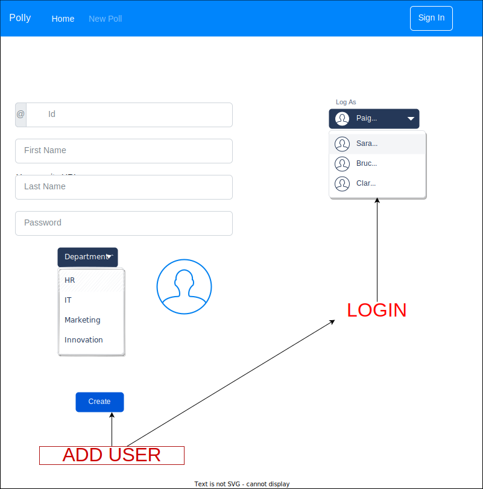
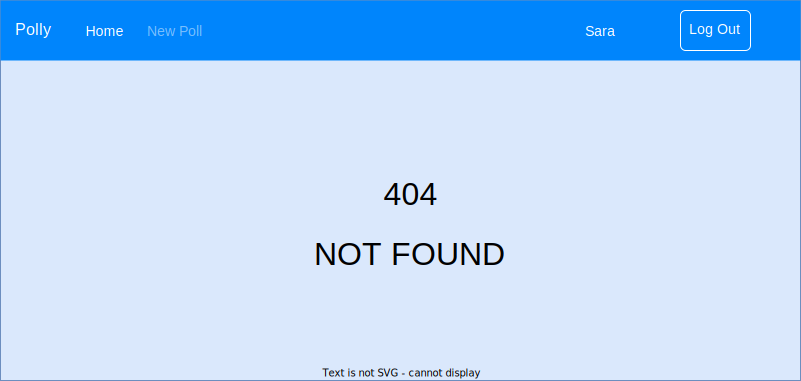

# Cahier des Charges

## Description

An application that employees can use internally to create polls.

A pool is a question to which employee can only choose one answer:
`Would you rather work 32 hour week in 4 or 5 days?`

## Views

| Requirement                                                       | View | Tested |
| ----------------------------------------------------------------- | ---- | ------ |
| When a user is connected, Then its name should appear on the page | All  | N      |
| When a user is logged in, Then he should be able to `Log Out`     | All  | N      |
| When a user is logged out, Then he should be able to `Sign In`    | All  | N      |

### Poll

#### Create a new poll

| Requirement                                                                                                                                          | View       | Tested |
| ---------------------------------------------------------------------------------------------------------------------------------------------------- | ---------- | ------ |
| An employee can create a pool                                                                                                                        | Add        | N      |
| An employee can answer a pool                                                                                                                        | Unanswered | N      |
| A user can see how other people have answers                                                                                                         | Answered   | N      |
| When a user navigate to the poll page And the question is answered, Then the page displays the poll statistics And the user's anwer is clearly shown | Answered   | N      |

Path: `/add`

To view an existing question.

Path: `questions/:question_id`

If the question is not answered by the user:

If the question was answered by the user:

### Dashboard

| Requirement                                                                    | View     | Tested |
| ------------------------------------------------------------------------------ | -------- | ------ |
| It lets a user can see polls not answered                                      | employee | N      |
| A user can toggle between her answered polls and unanswered polls              | employee | N      |
| When the primary view is show, Then unanswered polls should be displayed first | employee | N      |

Path: `/`

### Leaderboard

| Requirement                                                                             | View            | Tested |
| --------------------------------------------------------------------------------------- | --------------- | ------ |
| It can list every employee ordered by the number of polls they've created and answered. | HR and employee | N      |
| It lets HR give a prize each quarter for the top employees.                             | HR              | N      |
| Displays the ranking of users on the leaderboard                                        | Both            | N      |

Path: `/leaderboard`

### Login: Log As OR Sign Up

| Requirement                                                                                                                                                                   | View    | Tested |
| ----------------------------------------------------------------------------------------------------------------------------------------------------------------------------- | ------- | ------ |
| A user should be able to log in as an existing user                                                                                                                           | Log As  | N      |
| A user should be able to create a new user                                                                                                                                    | Sign Up | N      |
| When a user, not logged in, try to navigate to a page, Then he should be redirected to the login page And after logging in Then he should be redirected to the requested page | Log In  | N      |

### Not Found

| Requirement                                                              | View      | Tested |
| ------------------------------------------------------------------------ | --------- | ------ |
| When a user navigates to an unexisting pool, Then redirect to a 404 page | Not Found | N      |

